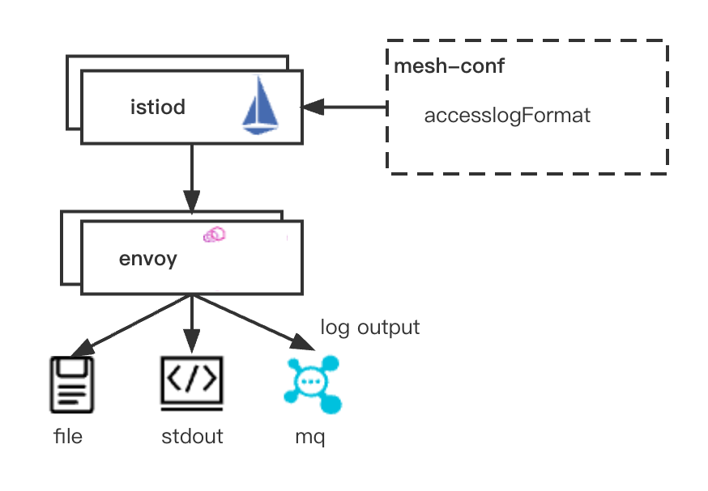

# 日志

Hango 提供动态可配置的日志链路，同时支持对接日志采集系统进行accessLog日志审计。

通过xds的配置,可以完成动态输出日志内容，满足用户对日志格式以及内容的自定义。同时，支持通过扩展的形式，对日志进行采样输出，可以选择性对200请求进行过滤采样，减少日志链路压力。

## 整体架构

Hango 日志链路整体架构如下：


Hango 网关扩展插件proxy.filters.http.metadatahub 用于对不同route进行日志追踪，通过metadata的扩展，可以方便的对路由元信息进行扩展。

## 配置参考

* accessLogFormat: 配置accesslog日志输出格式
采用envoy [FILTER_STATE](https://www.envoyproxy.io/docs/envoy/v1.24.0/configuration/observability/access_log/usage.html?highlight=filter_state)

```json
 accessLogFormat: "{\"method\":\"%REQ(:METHOD)%\",\"uri\":\"%REQ(X-ENVOY-ORIGINAL-PATH?:PATH)%\",\"protocol\":\"%PROTOCOL%\",\"duration\":\"%DURATION%\",\"respCode\":\"%RESPONSE_CODE%\",\"userIp\":\"%DOWNSTREAM_REMOTE_ADDRESS_WITHOUT_PORT%\",\"xffIp\":\"%REQ(X-FORWARDED-FOR)%\",\"requestId\":\"%REQ(X-REQUEST-ID)%\",\"time\":\"%START_TIME(%s%3f)%\",\"upstreamHost\":\"%UPSTREAM_HOST%\",\"originHost\":\"%FILTER_STATE(x-envoy-origin-host:PLAIN)%\",\"originMethod\":\"%FILTER_STATE(x-envoy-origin-method:PLAIN)%\",\"originPath\":\"%FILTER_STATE(x-envoy-origin-path:PLAIN)%\",\"originStatus\":\"%FILTER_STATE(x-envoy-origin-status:PLAIN)%\",\"upstreamServiceTime\":\"%RESP(X-ENVOY-UPSTREAM-SERVICE-TIME)%\",\"cacheStatus\":\"%RESP(X-Cache-Status)%\",\"fuseStatus\":\"%RESP(X-Envoy-Circuitbreaking)%\",\"downgradeStatus\":\"%RESP(X-Downgrade-Status)%\",\"secureStatus\":\"%RESP(X-Secure-Status)%\",\"userAgent\":\"%REQ(USER-AGENT)%\",\"remoteUser\":\"%REQ(REMOTE-USER)%\",\"bodyBytesSent\":\"%BYTES_SENT%\",\"httpReferer\":\"%REQ(HTTP-REFERER)%\",\"requestAuthority\":\"%REQ(:AUTHORITY)%\",\"clusterName\":\"%FILTER_STATE(qz_cluster_name:PLAIN)%\",\"serviceName\":\"%FILTER_STATE(qz_svc_id:PLAIN)%\",\"apiId\":\"%FILTER_STATE(qz_api_id:PLAIN)%\",\"apiName\":\"%FILTER_STATE(qz_api_name:PLAIN)%\",\"responseFlags\":\"%RESPONSE_FLAGS%\",\"projectId\":\"%FILTER_STATE(qz_project_id:PLAIN)%\"}\n"
```

* 日志过滤采样：采用EnvoyFilter patch accessLogFilter实现

配置参考：对http状态码>400的请求全记录，对<400的请求进行过滤记录。

```yaml
apiVersion: networking.istio.io/v1alpha3
kind: EnvoyFilter
metadata:
  name: accesslog-filter
  namespace: hango-system # as defined in meshConfig resource.
spec:
  configPatches:
  - applyTo: NETWORK_FILTER
    match:
      listener:
        filterChain:
          filter:
            name: "envoy.http_connection_manager"
    patch:
      operation: MERGE
      value:
        name: "envoy.filters.network.http_connection_manager"
        typed_config:
          "@type": "type.googleapis.com/envoy.extensions.filters.network.http_connection_manager.v3.HttpConnectionManager"
          accessLog:
            - filter:
                or_filter:
                  filters:
                  - status_code_filter:
                      comparison:
                        op: GE
                        value:
                          runtime_key: runtime.accessLog.response.code.key
                          default_value: 400
                  - runtime_filter:
                      runtime_key: runtime.accessLog.response.code.key
                      percent_sampled:
                        numerator: 50
```

## ResponseFlag

ResponseFlag 是Hango网关基于Envoy实现，所特有的日志flag状态，用于能够快速的定位upstream问题。

ResponseFlag参考：

* UH: 无可用健康的上游服务实例
* UF: 连接失败
* UO: 超出最大可pending请求
* NR: 无路由（404）或者服务未正确发布（503）
* URX: 超过最大重试次数
* DC: 客户端断开连接
* LH: 本地服务健康检查失败
* UT: 请求超时
* LR: 本地重置连接
* UR: 服务端重置连接
* UC: 上游连接中止
* DI: 请求被注入延迟后处理
* FI: 错误注入
* RL: 限流
* UAEX: 被鉴权插件禁止访问
* RLSE: 限流服务内部出错
* IH: 对于严格检查的header设置了不可用的值
* SI: 请求流空闲时间超时
* DPE: 下游请求存在HTTP协议错误